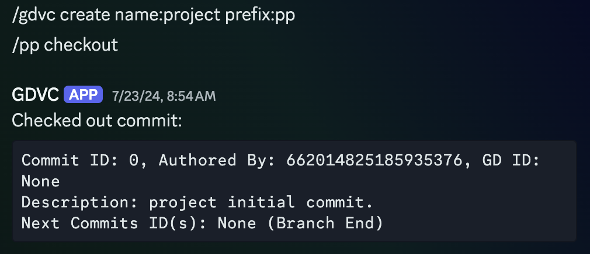
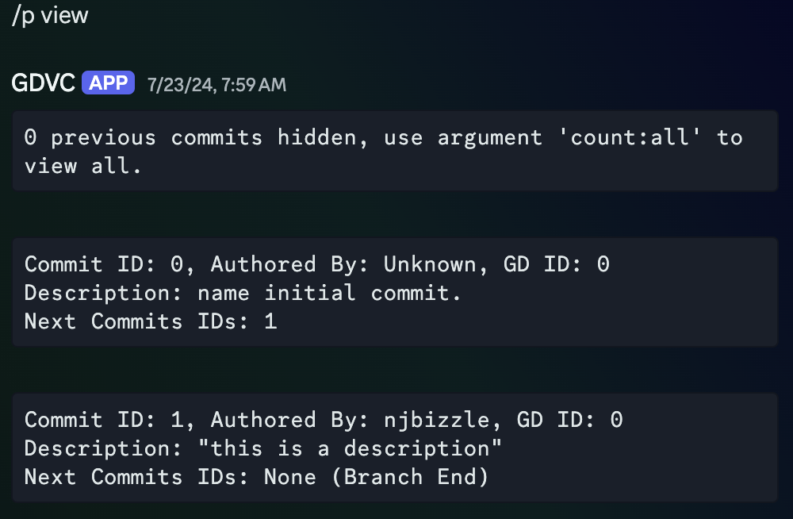

# GDVC (Geometry Dash Version Control), a Discord chatbot

#### A Discord chatbot that tracks change in collaborative level creation for the game Geometry Dash.

## Context

This is built for a game called Geometry Dash, in which user-created levels are uploaded to and downloaded from game servers. I've managed a lot of collaborative projects where 10+ people would be communicating over messaging platforms like Discord to work on a single level. The way that levels are shared makes it difficult to manage the most recent versions of levels, and it was something that I previously managed manually.

I love running these level collaboration projects, but they need constant maintenance over months, and I knew for a fact that there would be long periods of time where I just wouldn't have the time. So this was a way of automating it, allowing me to spend time more intermittently on the creative aspects, rather than constantly just making sure people weren't stepping on each other.

## Overview

This is a Discord bot that takes inspiration from software like Git to implement a version control system for managing larger collaborative projects. I wanted to make a bot that would be able to manage multiple projects between multiple communities, keep track of their working level IDs (which allows someone to copy a level off the game server), and then have the ability to push the edited version back to the project, as well as record information about the changes that were made. There are also features to make sure that only one person checks out the level at a time, and in case the level splits and branches off to form a tree of versions, the ability to visualize all the changes and prune these extra branches was added.

Sadly it didn't see any use outside of me and a few other people running tests, despite being in a working state.

## Tools Used

I made use of the Discord.py Python library which uses the asyncio library. Discord.py is an extensive library, but many features that go beyond reading and sending messages were reimplemented by me for fun.

## Aspects That I'm Proud of

This is a project where I'm very proud of my implementation and the code that I wrote. A lot of thought went into design for this project, and it ended up being extraordinarily robust, and it really needs to be if I'm letting anyone interact with it.

Since there is a lot of information that needs to be stored in a more permanent way, everything needs to be saved to and loaded from some file. The solution I came up with was to make a system to serialize all my Python objects into a JSON file and then load all the information back when the program starts up. With features such as projects in different Discord communities, permissions, and complex commit trees, this became a very large task, but I think my solution is pretty elegant.

This is by far my most involved Python project. To implement a lot of these features I had to do a lot of research into the inner workings of the language, especially for the JSON serialization. I also spent a lot of time learning the asyncio library, which ended up being much more complicated than I expected. I didn't end up making use of the more complicated features much, but it's a really cool library that operates on a super low-level, and I'm happy this project gave me an excuse to look into it a lot more.

I also hosted the bot myself. I have a Raspberry Pi which was running the script and I built a lot of tools to help me maintain the program while it was running. 

## Some Screenshots of It Working

### A Project is Created, Then the Initial Branch Was Checked Out

### All Commits on an Existing Project Are Displayed

